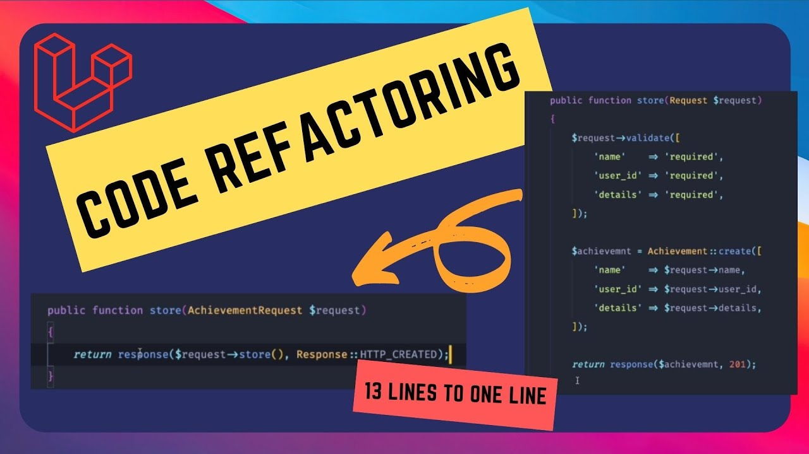

# Professional-Portfolio
Derrick Edowen's Professional Portfolio

## Description
The purpose of this project was to create a web developer portfolio that can be referenced and added to in the future.

## Installation
To open the project a user needs to open the index.html file in their browser.

## Usage
The following images were  used to produce the professional portfolio.

Header image:

Prework sample image:

Refactor sample image:

## Credits
Artistics Header - https://unsplash.com/photos/qHajeosTxBU
Prework Sample - https://www.gettingsmart.com/wp-content/uploads/2017/12/Program-Code-Feature-Image.jpg
Refactor Sample - https://i.ytimg.com/vi/rKwca8V7AnAmaxresdefault.jpg

## License
MIT License